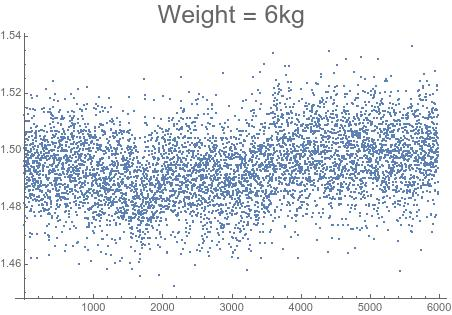

% Study of human in the loop concept for ankle robotic assistance
% Thomas Meessen
%

---
bibliography: bibliography.bib
link-citations: true
numbersections: true
...

# Motivation

# Orthosis

The Robotics & MultiBody Mechanics Research Group from the VUB propose an out-of-the-shelf prototype hardware for wearable robotic gait rehabilitation/assistance (see Fig. 1).
That robot is a compact spindle driven Mechanically Adjustable Compliance and Controllable Equilibrium Position Actuator (MACCEPA).
This design present good wearability due to the work made to minimize it's weight resulting to a value of 1.2 kg if the electric power-source is not included.

The device's controller (lower level) is designed to track a torque reference, furthermore, because the spring's pre-compression can be manually changed it is accepted as a parameter.
Conceived for the task of ankle rehabilitation it proved to be a convenient choice of interface which allow to plug a high level controller possibly tasked with the assistance strategy.

![Picture of the device published last year [@Moltedo283]. The electric motor and the compression spring are apparent](assets/Moltedo/detail_orthosis.jpg)

The measure received from the orthosis are the biological angle, the leverage angle and the motor density.
Those information are fed to two inner closed control loop for position and velocity while the outer open loop specifically track the torque.
Indeed the collected informations are sufficient to extrapolate the torque generated by the robot but there is yet no other measure taken that would give more information on the gait performances at the exception of buttons able to detect toe and heel contact.   

## Compliance

It well accepted that any physical interaction between human and robot should be at some point studied with regards to human safety [@Damme05].
This robot which is restricted to the role of an ankle actuator is dealing with patient’s neural/physical rehabilitation and it is important to provide the injured joint with required softness and compliance beyond the simple concept of causing pain.
With regards to the ankle rehabilitation such injuries would happen if a rigid joint would be actuated by an electric motor.
When confronted to possible patient's spasms a large torque might be applied to the ankle that would possibly cause an injury or at least pain.
For the ankle the range of admissible force could trivially be derived from the Angle-Torque pattern demonstrated by an healthy patient.
But that value should be reevaluated during the therapy if the muscle-tendon complex is injured .

### Implementation

Mitigation of safety issues when working with rigid robots have been done by modifying the original controller to implement a layer using impedance (force output to motion) to control.
This added layer may be configure with case specific stiffness and damping [@6296716].
There are however natural disadvantages including reduced speed and performances when including any form of compliance.
Beside those losses including compliance only on a virtual level limited to the controller provide a limited safety or more exactly not enough safety.
This is due to the technical constraints that the added level of controller complexity may lead to rigid behavior when a failure of some sort in the information chain is encountered.

As a consequence it is recommended to design wearable robots using alternative actuators that are intrinsically providing compliance because they include in their mechanical designs some elastic elements able to provide a suitable joint stiffness.
Soft actuator are for example pneumatic muscle actuators (PMAs), commonly used by physician but have the disadvantages of the weight and volume of they generating parts [@pmid19549338].
The MACCEPA design also provide a manually configurable stiffness by the compression spring [@Moltedo283; @Moltedo2018].

The implementation of compliance in the MACCEPA device has been studied by using a quasi-static benchmark able to show what force were generated as a function of the behavior of the patient (variation of the angle)(Fig. 2).
The experiment previously made show that the torque applied by the controller is accurately predicted by the mathematical model of the system and the measure collected (not shown here as it is not directly relevant).
That ability indicate that the measure in real time of the applied torque is possible.
Hence, it will be possible to implement a compliance control strategy based in admittance/impedance in the task space.

![Mechanical compliance of the ankle actuator for different compression level.
The slope is an indication of possible torque applied in case of fall, spasms or other errors.
The functioning point during push off is situated on a higher stiffness position.
Those results published in 2018 [@Moltedo2018] ](assets/Moltedo/compliance.png)

### Teaching with compliance

The role of the compliance control paradigm in rehabilitation it not limited to safety.
It is also play an important in a patient-cooperative control strategy like Assist-as-Needed [@7490335; @8313023].
When using this strategy the assistance is provided only if (near) real-time measure demonstrate the patient need it to reach the targeted performance.
It has the advantage to motivate the active participation of the patient during the exercise even leading to the possibility of creating engaging rehabilitation games.
This is an advantage commonly considered to quicken the rehabilitation due to effects related to psycho-plasticity.

As a consequence recent orthosis have been operated using a combination of adaptive control strategy and compliant actuator providing safety and enabling advanced rehabilitation strategy.
The control have effectively been done using task-space impedance control where the end-effector, here the ankle torque, is adapted with regard to the patient's voluntary participation.
This approach has it's limitation when applied to device that can have their stiffness adjusted by the controller.
This is the case for robots using PMAs the actuator's because the joint stiffness can simply be change by changing the muscles pressure, a faculty that can not be exploited by task space impedance control.
If the MACCEPA design evolve to have such characteristic and there is interest to have an hierarchy of control strategy that can control independently the physical and virtual compliance[@Liu2017].

## Dynamic characteristic

A first attempt to define the assistance that is desirable during walk is to simply emulate the ankle torque pattern of a healthy subject.
Using this approach the ability of the orthosis to track the desired torque have been measured for low to medium walking speed with good results up to 3 km/h and degrading tracking performance for increased speed [@Moltedo2018].
This result is quite positive considering the device is used in rehabilitation context where the likelihood off patient walking at speed around 4 to 5 km/h is low.
Besides at higher speed a less intense assistance is still possible without evolving the design.

# Empirical insights on gait

## Ankle role

### Inverse kinematic

Accounting the external mechanical work that occur during a normal walk was one of the early methods used to study gait.
The determination of this work require the measurement of kinetic information about the body and the ground reaction forces.
Over the years those measures have be done in a variety of way that are here briefly described and classified by complexity.

- __One force plate__ of a succession of plates in alignment coupled with velocity tracker were used to capture the walk of someone walking for a few meters before stepping on the plates.
However this simple technique suffered from underestimation as during the double stance phase on a single plate there is a experimental cancellation of forces between legs legs that pushes in opposite direction.
This cancellation of forces and work is problematic because it does not have a anatomical meaning[@pmid11747890].
- __Separated limb energy accounting__ was later developed and resolved the problem by using separate force plate to measure the external forces applied on each limb.
But this system alone have the inconvenient of only capturing a limited number of stride as the size of the force plate is a source of nonlinear error[@CAPPELLO2011724].
- __Instrumented treadmill__ is the combination of two separated force plate installed under a treadmill.
This greatly enhanced the number of strides that can be observed allowing for more detailed studies [@COLLINS200959 ; @LIST201798 ; @SLOOT2015610;].
This techniques has been commonly used in literature for that reason and because much of what is observed during a treadmill walk can be generalized to normal gait once the average 6 min of acclimatization are done [@Meyer2019].
- __Motion capture__ enabled the possibility to account the rate of energy change not only for center of mass but to break the exchange of work down to each lower segment of the body.
Further advancement in motion capture and computing technology have introduced the possibility to perform first 3 DOF and then 6 DOF inverse kinematic for the lower body and sometime the foot [@Zelik876].
Using inverse kinematic give the ability to compute the most likely movement of articulation based on the movement of position markers.
With this set of motion and a model of the body inverse dynamic compute the force and torque distribution on the joint of the lower limb which in fine allow a detailed analysis of the function of the ankle.

Based on such data the energy rate produce by the ankle have been shown to be the most influential during the push-off phase with a proposed effect of this work being the acceleration of the lower limb that in turn contribute to the acceleration of the COM [@Zelik3676].
This mechanical scenario for the ankle is supported by the ability for the knee joint to transmit energy during the push off due to it's flexion.
It is considered that little amount of the energy generated by the ankle during push-off is transmitted trough the knee joint and even less trough the hip [@Lipfert1218].

A finer description of the ankle work highlight the impulsive nature of this work as most of the energy is released after the the alleviation of the body weight due to the knee flexion [@Lipfert1218; @pmid15845776].
In this interpretation the release of energy happen after the mass of the body is alleviated and thus is in good correlation with the observed important acceleration of the trailing limb (mainly the lower segments).

### Push-off deficiency, hip work

In the effort of reducing hip pain possible correlation between hip effort and the ankle work during push-off has been investigated.
During this experience subjects have simply been instructed to push more on their feet while walking on an 6DOF equipped instrumented treadmill to observe the effect on the hip, concluding on a diminution of 12% of hip joint force [@LEWIS2015181].

Another study investigate the case individuals with unilateral below-knee amputation who present a decreased push-off and increased hip work resulting in a increased of the metabolic cost of the walk.
The experience involved powered ankle-foot prosthesis used to incrementally increase the push-off work from one-half to two-times normal levels while subjects with simulated amputation walked on a treadmill [@Caputo2014].
The observation made pointed toward a reduction of the hip work during the swing phase resulting in a lower metabolic cost induced by increase push-off.

From those insights it seem relevant to propose a scenario where a deficiency of the ankle during push-off is systematically compensated by a hip work during leg swing.
It should be noted that if this scenario proved to be correct __push-off deficiency could be detected by inertia measurement unit__ placed on the ankle orthoses due to detectable effects of hip work during swing.

A more exotic illustration of the hip work can be found in a study made to highlight possible explanation for increased metabolic cost a low speed.
The scenario tested was that walking with small step made more preeminent the metabolic cost induced by the hip while assuring the circumduction of the trailing leg around the standing leg.
A study was performed where subjects were asked to walk with their gait modified by lightweight fins so that circumduction was exaggerated and the relative importance of the metabolic cost of the hip work could be highlighted [@SHORTER2017265].
While the result of the study have been directed to understanding the balance behind the choice of the preferred step length it is also another indication that an increased hip work have a strong effect on metabolic cost.

## Recycling energy

Leaving the field of energy accounting and to take a closer look at the internal functioning of the extensor muscle fibers require the usage of ultrasonographic apparatus.
Some highlights can be gained as this imaging technique reveal that the extensor muscles of the ankle (gastrocnemius and soleus) are operating near-isometrically during late-stance phase [@pmid15845776].
Because isometric contraction means that the muscles is not generating work as it do no change it's size this is a good indication that during the push-off phase the majority of the power not generated from metabolic cost but rather liberated from stored potential energy in the Achilles tendon.
For healthy subject this lead to the interpretation that muscle-tendon complex is recycling energy from the loading of the ankle during early stance and have the consequence of reducing the metabolic footprint of the push-off power due to the cost being limited to isometric the contraction of the soleus and gastrocnemius.
This mechanism is rather common and much similar of those find commonly on vertebrae and that are involved in reducing the metabolic cost for movement [@Roberts353].

From this insight there a lot of information that can be used for understanding the metabolic impact of robotic ankle assistance.
It is then rather clear that replacing the work made by the ankle is not so metabolically interesting as one may first think because that work is not directly paid by the body.
Which lead to more explanation for metabolic cost change that could probably be found by investigating work made by muscle that overall provide small work but do so by using far less efficient mechanism and thus having a great impact on the metabolic cost.

## Learning to walk, co-contraction and stability

To study the evolution of gait due to modification such as external power it is useful to have an idea on the activation pattern of the muscles and how it affected by the gait modification.
The electromyography is thus an essential technique that measure the activity of muscles by placing electrodes on the skin of patient that are able to measure the electric potential generated by muscles cells.
The singular insight of this techniques is that it able to measure the co-contraction of muscles which are invisible to inverse kinematics but induce a yet unquantified metabolic cost.
Muscular co-contraction is a well known mechanisms used by the body to stiffen his joints in order to improve it's stability and more generally to control it's movement[@pmid28324993].

The more common case of important co-contraction happen in a healthy subject with relation to a transitory period where the body is learning a knew gait and will progressively learn what muscle should be less recruited and when confronted to interactions with unstable mechanical environments [@pmid18584164].
Experiences have highlighted the reaction of the muscular activity to the use of powered exoskeleton and observed such behavior for the soleus and gastrocnemius [@Galle495; @GORDON20072636].
This reduction of muscle co-contraction recruitment can be related to the reduction metabolic cost after having learned how to walk with an exoskeleton.
From those studies it appear that both kinematic gait description and electromyography describe the same learning period during approximately 30 min.
The learned gait efficiency and kinetic gait description are retained if reused a few day later.

The study of subject with hemiparesis reveal that they present a excessive co-activation in the non-paretic leg when compared to healthy subjects and that the difference is and proportional to the severity of the impairment [@pmid11102843].
The decrease of gait stability due to lower joint stiffness (due to no co-contraction) in the paretic leg is interpreted as a cause of gait instability which lead to this proposed adaptation mechanism to be used in impaired gait.
Further investigation on co-activation show that is it more present in older adult that have recently fallen and developed a fear of falling [@pmid21606665].
Both study reinforce the proposition that __low gait stability resulting of impairments is related to a general increase of co-activation in the lower and upper body__.

Description of kinematic stability is subtly different that time variability because errors in control or other gait disturbance are constantly happening and there is a limited interest to measure such variability in amplitude because they are continually manifest.
Thus stability is the description of the attenuation of kinematic variability and it can be performed for a general dynamic system by discussing the Lyapunov exponent [@pmid12763440; @England2007].
The ability to measure the stability of the gait provide a good description of the difficulty for the subject to control the gait and thus on how much the subject might rely on excessive co-contraction without having to perform electromyography.

## Burning the O2

One common interpretation of the natural gait describes it as the result of a long process of metabolic cost reduction constrained with a set of task-related performance criteria.
Those constraints are the quality of a gait that can be expressed at an high level as the perceived comfort or the ability to adapt to a change in the environment or in the intention.
The cost optimization is however not the most important objective for a body if confronted to an impairment or a hostile environment will use a costly mechanism to restore subjective quality criteria.

When studying the walking gait it is often omitted to measure the stability or the comfort of the subject because these are dimensions that does not have yet a precise definition.
In this condition the work start with the prior expert knowledge of mechanical work used to design a likely favorable assistance space.
Then, the measure of the 02 burned by the body for each assistance strategy give a representation of how well the obtained gaits are accepted by the body.
If the gait is not stable for example the metabolic cost will remain high due to the recruitment of additional muscles.

### A difficult measure

As mentioned, the total metabolic cost is a accepted indicator for the gait efficiency but it has the disadvantage of not being directly measurable.
A common practice is to build a measurable proxy such as the breath-based volumetric oxygen consumption [@Kramer0021290; @pmid28642437] or predictive formulas in some cases[@pmid1597173].
As there is not yet predictive concept for rehabilitation commercial devices are available for breath-based techniques, but the noise in the 02 and C02 concentration require to average over multiple breaths.
Combined with the inertia of the metabolic process the measures obtained have a low temporal resolution.
Experiments often consider 2 min of maintaining the gait as a sufficient time to reach a steady-state that allow for a meaningful reading [@Zhang1280; @QUESADA20163452].

In addition metabolic cost are impacted by VO2 drift, a phenomena characterized by the 02 consumption stabilizing at a higher consumption rate when a prolonged strenuous activity is involved.
For that reasons experiences often involve short walking bout interlaced with sufficient resting period.
Even so if slow walking is not usually described as strenuous for a healthy subject.

In conclusion the informations obtained by breath-based techniques are useful for ordering a set of pattern.
But their usage within a control loop is problematic, the low temporal resolution does not allow for a stride by stride or inter-stride regulation.
In reaction, studies are acknowledging this problem and are attempting to build an aggregation of information obtained via wearable physiological sensors such as skin temperature, electrodermal activity, heart rate or accelerometry, ... [@pmid28813842; @Nguyen229].
The efforts are made by feeding the data to learning algorithms or analytical tools such a regression with to objective of predicting the metabolic cost but it will take some more time to define a proxy faster to measure.

### Search for a optimum pattern

As mentioned the metabolic cost is frequently used to give a order to a set of assistance pattern if the patients are able to walk for a prolonged period of time.
One search strategy build around the evolution strategy use the a covariance matrix generated from a generation to create the next generation of pattern [@pmid28926613; @Nguyen229].
The role of the patient is to walk, trying each pattern in the generation to give them a metabolic score.
Other search methods such as the trivial grid search or the gradient descent are too used for this purpose.
The Fig illustrate the result of a search using the covariance matrix adaptation evolution strategy.
On this figure the inter-subject difference between optimum torque is another useful insights on how tailored a solution needs to be.

![This graph was published by [@Zhang1280] and represent the optimum average torque-pattern as a function of the % of gait cycle found for each subject. The torque pattern space was defined using peak-time, rise and fall time and peak torque, defining a space very similar of what could be expected from natural ankle (one peak with a faster fall) .](assets/torque_pattern.png)

Different search strategies yield different quality of result due to the size of the search space which impose a good convergence speed and the existence of local extremum.
However this experiment has demonstrated that a reduction of 33% of the metabolic cost associated with walking is possible while other experiment without individual tailoring demonstrated a lot less reduction [@QUESADA20163452].
So there is still the question of why is it only one third of reduction and what could be the limitation of the current search?

#### Limitations

It has been demonstrated that walking while "pushing more on the foot" reduce the recruitment of the hip.
However the torque pattern used as the prior assumption for the assistance torque are the torque of a normal walk [@LEWIS2015181].
It is unknown if a natural gait that rely on the ankle work is different in term of ankle activation.
But if it is then the previous search will not discover it because learning take time, between 15 and 30 min in some cases [@GORDON20072636], and always start with a higher metabolic cost.
So if a convenient torque is proposed during the search but would require to walk "as if the ankle was more used" it would be dismissed it in favor of a local optimum close to the learned gait.
This question have much more repercussion for impaired patient where the "fine optimization tuning" based on metabolic cost can only happen after a gait close to the targeted is learned by the patient.

Besides inaccessible extremum using the metabolic cost to drive the search have another limitation when reviewing the insights gathered so far.
For an impaired patients, victim of a paretic leg, the increase metabolic cost can be explained via a some likely scenarios:

- Hip work is used to compensate for the lack of swing velocity, hip work have possibly an higher metabolic footprint than ankle work due to the necessity of stiffening other joints on the body to use it.
- Low joint stiffness induce gait instability which cause the recruitment of costly co-contraction across the body (including the upper part).
- Higher mechanical cost due to increase in collision or lack of recycling.

The observation is that walking is not only costly due to the mechanical effort but also because of the targeted stability.
While the repartition of cost is yet unknown there are indications that the control mechanism is costly because it uses co-contraction and other hip/knee work.
If the ankle is not designed to facilitate the control of the lower limb those cost remain unreduced.
So the question is double:

- Is the ankle playing an important role in natural gait stability? If not there is probably a low ceiling in what can be achieved.
- How to close the loop with a high temporal resolution? So the orthosis may help reducing joint stiffness.

Going forward on the road of cost reduction is not a natural path as the objective of the device is to rehabilitate the patient.
But if it is considered useful to improve the comfort and efficiency of the patient to replace or assist some of the impaired body control mechanism then the metabolic cost can not be used.

# Defining a gait

We presented some insights on the internal mechanisms that could be involved in walking at low speed.
However there is still a lack of methods for gait representation that is required to implement a controller.

Moreover, the elements found in this space should easily be associated with their metabolic cost.
Indeed defining this space is required before studying a strategy to navigate in it.

# Instrumented Treadmill Calibration

So far the importance of proper measurement of kinematic and dynamic parameters have been illustrated dot to the technique's great important in gait analysis.
However the implementation of an human in the loop control on wearable robotic assistance will probably use IMU as the acquisition instrument.
But there are still a number of steps and demonstration that require inverse dynamics ahead.
Therefore the instrumented treadmill possessed by the Robotics & MultiBody Mechanics Research Group from the VUB is of great interest.

Thus there is a need to learn the usage of this instrument that is formed by the interconnection of two force plates assembled under a treadmill in a room with over 10 motion capture cameras.
The proposed way to do so is by performing the instrument calibration.
Due to the common usage of IT in robotic lab some literature can be found on subject that suggest to use a linear calibration and to build a known reference build by a force-sensitive stick that have goos tracking performances [@COLLINS200959; @LIST201798; @CAPPELLO2011724].
This calibration procedure only cover the forces plate precision end the detection of the center of pressure(COP) and it's amplitude.
The motion capture precision is falling off the scope of this work, having it been recently done.

## Calibration Wand

## Design

Due to the frequent need for this calibration wand a design is available in the literature.
Even more it is available on the market, one example being the MTD-3 from Motion Lab Systems.
Nevertheless, a description of it's characteristic is required as it has been chosen to reproduce the design at the lab.

The role of the wand is to apply a precisely measured pressure.
It means that the force transmitted should be aligned with the force cell and that no torque is transmitted when used on the plate.
In addition the calibration procedure will require to use it angles up to 45°.
Therefore it should be reasonable lightweight so that no compensation for it's mass needs to be introduced.

Negating torque transmission is traditionally done by using ball-joints.
A similar but simpler approach consist in creating a sharp end on both side of the main shaft, one for the handle and the other for the ground.
However that approach would require to provide a thin protective layer to not harm the treadmill's rubber, in our case a thin mdf plate.

For materials, the constraint is to not observe bending when a human-made force is applied and being too dense.
Metal cylinders found at one of the lab's left-over pile met this criteria and based on it's dimension the detailed design have been drawn by Louis Flynn on CAD software for which he had experience.
In this design, the available sensor (a load cell Futek LCM300) is screwed on one side to the main shaft and at on other side to a pointy piece of metal machined to match the shaft's dimensions.
While the other pointy piece has been stamped to other side.

In order to track the orientation of a line in 3D space, a common practice is to place 4 optical markers on a physical plan and then defining in the software the line of interest based on those markers.
In practice, two small rods have been welded in approximately perpendicular position.
Lastly, an additional marker has been placed to break the symmetry.
This allow for an easier object acquisition by the motion capture system.

## Load cell calibration

The acquisition chain is composed of the load cell amplified and then acquired by the instrument's acquisition card.

Materials:

* 1D Load Cell : Futek LCM300 S/N 663656, calibration file obtained from the constructor.
* Amplifier Module : Futek CSG110 S/N 272035, manual available online
* Power supply: Topward 6303DS

### Setting-up the amplification

The power supply for the amplification module is configured AT 20v, enabling the maximum resolution.
The sensor is supplied in energy by the CSG110 at a voltage of 10V as recommended in the sensor's manual.
To select the gain on the signal the sensibility is retrieved from the factory's calibration data:

- 22 kg : 0.4 mV/V
- 45 kg: 0.8 mV/V
- 68 kg : 1 mV/V

In this context the applied weight will not get higher than 70 kg for practical reasons (hard to push more) and because the calibration doesn't requires it.
The sensor is considered to have a sensibility of 1 mv/V which means that for an supply of 10 V he will produce 10 mV of signal.
For those characteristics the manuals of the CSG110 suggest to use the configuration 2, with only the second switch flipped up.

#### Troubleshooting

The first attempts to set the amplification module to an excitation of 10 V resulted in saturation from the CSG110.
After a few attempts it was found that the small differences found on the circuit from the manual description should not have been overlooked because it was an older model.
After a search at the lab a model conform with the circuit description was found and the setup properly worked.
The saturation problem with the older version of the amplification modules have not been addressed.

#### Validation

After assembly a series of test have been done to verify the instrument, using the multimeter ANENG AN8008.

Simple measures have been done:

* Input/output resistance for the load cell:  744 Ohms / _reference : 743 Ohms_
* Voltage out from the power supply :  20.2V / _reference : 20.1V_
* Sensor's excitation : 10 V / _reference : 10 V_
* The signal acquired cover all the available range
* Noise : measured : 45mV / _Expected : 35mV_

__Those measure are consistent with a well functioning acquisition chain.__

#### Calibration

The next step required to calibrate the wand by using known weights available at the lab:

The measured voltage have been averaged on a 30s sample then compared with the voltage expected from the data points found in the factory calibration sheets.
A linear regression of those calibration points (Voltage/weight) gives the following relation:

 _Voltage(V) = 0.00980952 + 0.178025 weight(g)_

 A graphical comparison can be found at Fig where it can be seen that there is a difference in slope with a higher voltage measure that what was expected

The next step is to evaluate the importance of the noise ( Fig ~  ).
The average voltage span of the noise is measured and then translated into mass using a linear regression of the measurement points.
The results obtained were __a noise of 12 mV of amplitude which translate to a mass of 98 g__.
The weight of the wand have also been deduced and is expected to be around 1.6kg, confirmation obtained using kitchen scale.

# References
