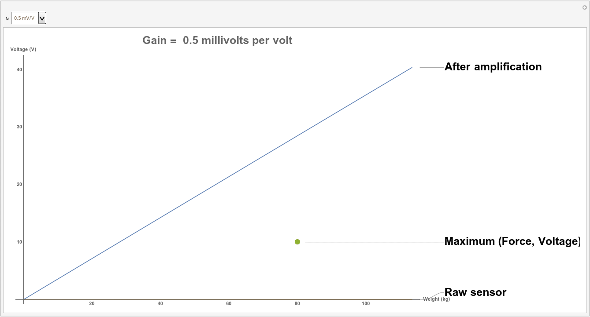

% Study of human in the loop concept for ankle robotic assistance
% Thomas Meessen
%

---
bibliography: bibliography.bib
...

# Motivation

# Orthosis

## Compliance

A physical interaction between human and robot exist should always be at some point studied with regards to safety [@Damme05].
A robot that is restricted to the role of an ankle actuator is dealing with patient’s neural/physical rehabilitation and it is important to provide the injured joint with required softness and compliance beyond the simple concept of causing pain.
Such injury would happen if the joint was actuated by an electric motor, confronted to the patient's spasms large torque might be applied to the ankle, possibly causing an injury.
The range of admissible force can trivially been derived from the Angle-Torque pattern for the patient the ankle, possibly revised as the rehabilitation progress.

To mitigate the safety concern of rigid robots one methods consist in add to the control scheme a impedance (force output to motion) control with proper stiffness and damping [@6296716].
There is however a disadvantage to only providing the necessary compliance at the level of the controller as the added level of complexity may lead to rigid behavior when a failure of some sort is encountered.
So it is recommended to use alternative actuators that intrinsically provide compliance by including in the mechanical design some elastic elements that provide a suitable joint stiffness.
This is the case for pneumatic muscle actuators (PMAs) [@pmid19549338] or the design MACCEPA (Mechanically Adjustable Compliance and Controllable Equilibrium Position Actuator)[@Moltedo283].

The role of the compliance control paradigm in rehabilitation it not limited to safety.
It is also an important part in patient-cooperative control strategy such as Assist-as-Needed [@7490335; @8313023] where the assistance is provided to the patient only when (near) real-time measure demonstrate it need it.
This scheme pose the challenge of the determination of the patient movement ability but encourages patient's active participation to provoke neuroplasticity.
Recent orthosis have thus been operated using a combination of an adaptive control strategy and a compliant actuator.
That have been done effectively using task-space impedance control where the end-effector, here the ankle torque, is adapted with regard to the patient's voluntary participation.
For robots using PMAs the stiffness of the actuator can be commanded by simply changing the pressure and there is interest to have an hierarchy of control strategy that can exploit both the physical compliance and the virtual[@Liu2017].

For the implementation of MACCEPA considered in this project quasi-static benchmarking have shown that the applied torque could accurately be predicted using the known spring precompression level and deflection angle.
With this ability to measure in real time the torque applied to the patient it is possible to implement a compliance control strategy based in admittance/impedance in the task space.
Passive compliance is achieved by setting the precompression of the spring [@Moltedo2018].

The angle-torque characteristics of the robot is the ability of the actuator to provide torque to resist a change of the angle with regard to the reference.
Following our discussion on compliance it is expected to not obtain a stiff slope around the origin and the Near-Static benchmark presented in Fig ... illustrate how an the stiffness setting on the actuator effect the torque generated.
It is also the occasion to illustrate the first compromise involved in the use of this robot as the amount of torque generated by the actuator is proportional to the stiffness of the joint.

## Dynamic characteristic

A first attempt to define the assistance that is desirable during walk is to simply emulate the ankle torque pattern of a healthy subject.
Using this approach the ability of the orthoses to track the desired torque have been measured for low to medium walking speed with good results up to 3 km/h and degrading tracking performance for increased speed[@Moltedo2018].
This result is quite positive considering the rehabilitation context and the likelihood that the patient would require less assistance if he was already able to walk at speed around 4 to 5 km/h.

# Empirical insights on gait

## Ankle role

### Inverse kinematic

Accounting the external mechanical work that occur during a normal walk was one of the early methods used to study gait.
The determination of this work require the measurement of kinetic information about the body and the ground reaction forces.
Over the years those measures have be done in a variety of way that are here briefly described and classified by complexity.

- __One force plate__ of a succession of plates in alignment coupled with velocity tracker were used to capture the walk of someone walking for a few meters before stepping on the plates.
However this simple technique suffered from underestimation as during the double stance phase on a single plate there is a experimental cancellation of forces between legs legs that pushes in opposite direction.
This cancellation of forces and work is problematic because it does not have a anatomical meaning[@pmid11747890].
- __Separated limb energy accounting__ was later developed and resolved the problem by using separate force plate to measure the external forces applied on each limb.
But this system alone have the inconvenient of only capturing a limited number of stride as the size of the force plate is a source of nonlinear error[@CAPPELLO2011724].
- __Instrumented treadmill__ is the combination of two separated force plate installed under a treadmill.
This greatly enhanced the number of strides that can be observed allowing for more detailed studies [@COLLINS200959 ; @LIST201798 ; @SLOOT2015610;].
This techniques has been commonly used in literature for that reason and because much of what is observed during a treadmill walk can be generalized to normal gait once the average 6 min of acclimatization are done [@Meyer2019].
- __Motion capture__ enabled the possibility to account the rate of energy change not only for center of mass but to break the exchange of work down to each lower segment of the body.
Further advancement in motion capture and computing technology have introduced the possibility to perform first 3 DOF and then 6 DOF inverse kinematic for the lower body and sometime the foot [@Zelik876].
Using inverse kinematic give the ability to compute the most likely movement of articulation based on the movement of position markers.
With this set of motion and a model of the body inverse dynamic compute the force and torque distribution on the joint of the lower limb which in fine allow a detailed analysis of the function of the ankle.

Based on such data the energy rate produce by the ankle have been shown to be the most influential during the push-off phase with a proposed effect of this work being the acceleration of the lower limb that in turn contribute to the acceleration of the COM [@Zelik3676].
This mechanical scenario for the ankle is supported by the ability for the knee joint to transmit energy during the push off due to it's flexion.
It is considered that little amount of the energy generated by the ankle during push-off is transmitted trough the knee joint and even less trough the hip [@Lipfert1218].

A finer description of the ankle work highlight the impulsive nature of this work as most of the energy is released after the the alleviation of the body weight due to the knee flexion [@Lipfert1218; @pmid15845776].
In this interpretation the release of energy happen after the mass of the body is alleviated and thus is in good correlation with the observed important acceleration of the trailing limb (mainly the lower segments).

### Push-off deficiency, hip work

In the effort of reducing hip pain possible correlation between hip effort and the ankle work during push-off has been investigated.
During this experience subjects have simply been instructed to push more on their feet while walking on an 6DOF equipped instrumented treadmill to observe the effect on the hip, concluding on a diminution of 12% of hip joint force [@LEWIS2015181].

Another study investigate the case individuals with unilateral below-knee amputation who present a decreased push-off and increased hip work resulting in a increased of the metabolic cost of the walk.
The experience involved powered ankle-foot prosthesis used to incrementally increase the push-off work from one-half to two-times normal levels while subjects with simulated amputation walked on a treadmill [@Caputo2014].
The observation made pointed toward a reduction of the hip work during the swing phase resulting in a lower metabolic cost induced by increase push-off.

From those insights it seem relevant to propose a scenario where a deficiency of the ankle during push-off is systematically compensated by a hip work during leg swing.
It should be noted that if this scenario proved to be correct __push-off deficiency could be detected by inertia measurement unit__ placed on the ankle orthoses due to detectable effects of hip work during swing.

A more exotic illustration of the hip work can be found in a study made to highlight possible explanation for increased metabolic cost a low speed.
The scenario tested was that walking with small step made more preeminent the metabolic cost induced by the hip while assuring the circumduction of the trailing leg around the standing leg.
A study was performed where subjects were asked to walk with their gait modified by lightweight fins so that circumduction was exaggerated and the relative importance of the metabolic cost of the hip work could be highlighted [@SHORTER2017265].
While the result of the study have been directed to understanding the balance behind the choice of the preferred step length it is also another indication that an increased hip work have a strong effect on metabolic cost.

## Recycling energy

Leaving the field of energy accounting and to take a closer look at the internal functioning of the extensor muscle fibers require the usage of ultrasonographic apparatus.
Some highlights can be gained as this imaging technique reveal that the extensor muscles of the ankle (gastrocnemius and soleus) are operating near-isometrically during late-stance phase [@pmid15845776].
Because isometric contraction means that the muscles is not generating work as it do no change it's size this is a good indication that during the push-off phase the majority of the power not generated from metabolic cost but rather liberated from stored potential energy in the Achilles tendon.
For healthy subject this lead to the interpretation that muscle-tendon complex is recycling energy from the loading of the ankle during early stance and have the consequence of reducing the metabolic footprint of the push-off power due to the cost being limited to isometric the contraction of the soleus and gastrocnemius.
This mechanism is rather common and much similar of those find commonly on vertebrae and that are involved in reducing the metabolic cost for movement [@Roberts353].

From this insight there a lot of information that can be used for understanding the metabolic impact of robotic ankle assistance.
It is then rather clear that replacing the work made by the ankle is not so metabolically interesting as one may first think because that work is not directly paid by the body.
Which lead to more explanation for metabolic cost change that could probably be found by investigating work made by muscle that overall provide small work but do so by using far less efficient mechanism and thus having a great impact on the metabolic cost.

## Learning to walk, co-contraction and stability

To study the evolution of gait due to modification such as external power it is useful to have an idea on the activation pattern of the muscles and how it affected by the gait modification.
The electromyography is thus an essential technique that measure the activity of muscles by placing electrodes on the skin of patient that are able to measure the electric potential generated by muscles cells.
The singular insight of this techniques is that it able to measure the co-contraction of muscles which are invisible to inverse kinematics but induce a yet unquantified metabolic cost.
Muscular co-contraction is a well known mechanisms used by the body to stiffen his joints in order to improve it's stability and more generally to control it's movement[@pmid28324993].

The more common case of important co-contraction happen in a healthy subject with relation to a transitory period where the body is learning a knew gait and will progressively learn what muscle should be less recruited and when confronted to interactions with unstable mechanical environments [@pmid18584164].
Experiences have highlighted the reaction of the muscular activity to the use of powered exoskeleton and observed such behavior for the soleus and gastrocnemius [@Galle495; @GORDON20072636].
This reduction of muscle co-contraction recruitment can be related to the reduction metabolic cost after having learned how to walk with an exoskeleton.
From those studies it appear that both kinematic gait description and electromyography describe the same learning period during approximately 30 min.
The learned gait efficiency and kinetic gait description are retained if reused a few day later.

The study of subject with hemiparesis reveal that they present a excessive co-activation in the non-paretic leg when compared to healthy subjects and that the difference is and proportional to the severity of the impairment [@pmid11102843].
The decrease of gait stability due to lower joint stiffness (due to no co-contraction) in the paretic leg is interpreted as a cause of gait instability which lead to this proposed adaptation mechanism to be used in impaired gait.
Further investigation on co-activation show that is it more present in older adult that have recently fallen and developed a fear of falling [@pmid21606665].
Both study reinforce the proposition that __low gait stability resulting of impairments is related to a general increase of co-activation in the lower and upper body__.

Description of kinematic stability is subtly different that time variability because errors in control or other gait disturbance are constantly happening and there is a limited interest to measure such variability in amplitude because they are continually manifest.
Thus stability is the description of the attenuation of kinematic variability and it can be performed for a general dynamic system by discussing the Lyapunov exponent [@pmid12763440; @England2007].
The ability to measure the stability of the gait provide a good description of the difficulty for the subject to control the gait and thus on how much the subject might rely on excessive co-contraction without having to perform electromyography.

## Burning the O2

The metabolic cost is a broadly accepted indicator of the gait efficiency because it encompass all possible energy expenditure due to the mainly aerobic nature of human cells.
However it cannot be directly estimated and it is common to use as a proxy such as the volumetric oxygen consumption based on breath analysis.
Difficulty in using this techniques including slow dynamic due to the metabolic inertia, noise  [@Kramer0021290] and VO2 drift which is a phenomena characterized by the 02 consumption stabilizing at a higher consumption rate due to prolonged strenuous activity .

The characteristics of the measure of oxygen rate consumption lead to sampling time used to determined the steady-state during gait analysis being as long as 2 min [@pmid28642437].
This is problem if the metabolic cost is the objective for the control strategy because only general mechanism and slow control scheme can be operated.
Explaining and describing the origin of the metabolic cost during walk is a challenge but it is very important because it allow to build proxy that are more accessible if based for example on kinematic parameters.

So far the insights gathered point out that an paretic leg in a impairment that induced an increase metabolic cost via a two likely scenario:

- Hip work is used to compensate for the lack of swing velocity, hip work is more costly than ankle work due to the absence of recycling of energy
- Low joint stiffness give instability to the gait and provoke a costly co-contraction of muscles across the body.

# Instrumented Treadmill Calibration

So far the importance of proper measurement of kinematic and dynamic parameters have been illustrated dot to the technique's great important in gait analysis.
However the implementation of an human in the loop control on wearable robotic assistance will probably use IMU as the acquisition instrument.
But there are still a number of steps and demonstration that require inverse dynamics ahead.
Therefore the instrumented treadmill possessed by the Robotics & MultiBody Mechanics Research Group from the VUB is of great interest.

Thus there is a need to learn the usage of this instrument that is formed by the interconnection of two force plates assembled under a treadmill in a room with over 10 motion capture cameras.
The proposed way to do so is by performing the instrument calibration.
Due to the common usage of IT in robotic lab some literature can be found on subject that suggest to use a linear calibration and to build a known reference build by a force-sensitive stick that have goos tracking performances [@COLLINS200959; @LIST201798; @CAPPELLO2011724].
This calibration procedure only cover the forces plate precision at measuring the center of pressure(COP) and it's amplitude.
The motion capture precision is falling off the scope of this work.

## Design of the stick

### Requirements

#### Material

* 1D Load Cell : Futek LCM300 S/N 663656
  * Calibration file from the constructor obtained: _Master Project/Calibration/Futek/FutekLCM300.pdf_
* Amplifier Module : Futek CSG110 S/N 272035
  * Calibration from Futek:
* Power supply: Topward 6303DS

#### Assembly

#### Protection of the treadmill

To protect the rubber band from the pressure applied by the sharp point a protective measure is needed.
The constraints are that a protective layer need to be thin to avoid creating moment and sufficiently adherent
so that the point does not move.

A  plate of mdf was used.

#### Axial Force measure
##### Signal Amplification

The power supply used for the amplifier CSG110 was a Topward 6303DS set up to provide 20 V to a CSG110 amplification module.
The CSG110 sensor excitation voltage was set to match the reference for the LCM300 (10V) and the amplifier gain was set to be 1 mV/V after comparison of the calibration data for the LCM,with regard to the operational range expected not to be higher than 80kg and with the voltage limitation of 20 V in mind.

##### Zero Setting

To be able to use a maximal range of voltage after amplification it is important to set the zero correctly at this level.

The procedure followed was as recommended in the sensor manual.

##### Validation

After assembly a series of test have been done to verify the instrument, using the multimeter ANENG AN8008 S/N 73802820.

Simple measures have been done:
* The load sensor presented the referenced input/output resistance :  744 Ohms / _reference : 743 Ohms_
* Voltage out from the power supply :  20.2V / _reference : 20.1V_
* Excitation at sensor's pin : 10 V / _reference : 10 V_
* Signal voltage after amplification span the entirety of the available range.
* Noise : measured : 45mV / _Expected : 35mV_

__From those measures it is deduced than the instrument are well connected and alimented.__

Than a set of known weight were applied to the RFA to validate the amplification ratio and to assess precision.
From the calibration data a linear model has been extracted _Voltage(Vol) = 0.00980952 + 0.178025 weight(kg)_

__Picture from weights__

##### Troubleshooting

The first attempt to set the amplification module to an excitation of 10 V and a gain of 2 mV/V resulted in the CSG110 being in a state where it had an constant sensor output independently of the sensor's state.
Another attempt on the same model shown the same result finally a more recent module was used with an circuit board closely conform to the one of the manual.
Once the excitation voltage has properly been setup the acquisition chain behaved accordingly to the expectations.
Problem with the other amplification modules have not been addressed.

**Insert Pictures**

#### Spatial location

# Unanswered questions

- Is the muscles still operating isometrically when the gait is benefiting from powered exoskeleton?

# References
